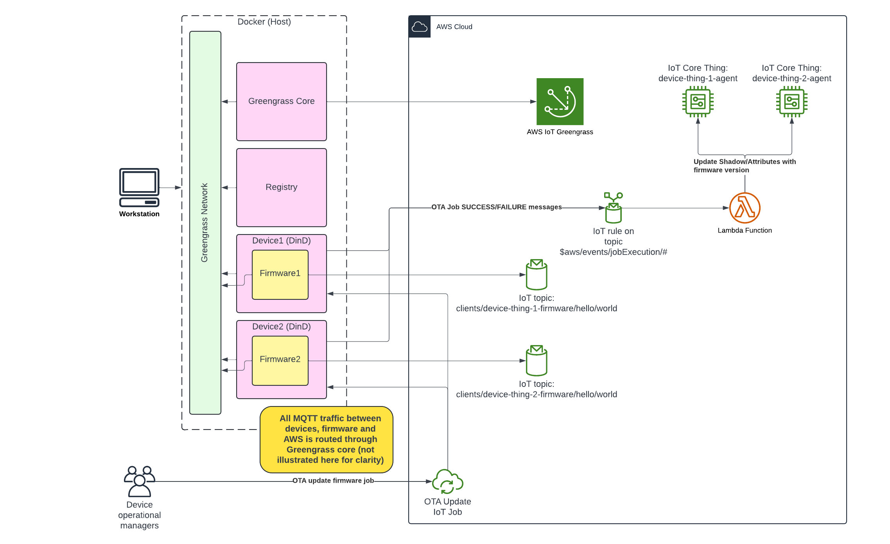

# OTA robotics firmware updates using Greengrass v2 and ROS2

## Introduction

Deploying Over-The-Air (OTA) updates to your fleet of devices is a critical process to get right. A good process to manage OTA updates allows your business to:
- Keep devices up to date with the latest security and bug fixes
- Deploy the latest updates and features
- Keep track of deployment statuses - identifying quickly when a firmware update is failing, and patterns in device hardware where these failures are happening
- Automatically roll back failed firmware updates to previously running (known good) versions
- Identify devices that have not been updated for an extended period of time, including those that are running end of life (EOL) code.

The solution presented here demonstrates how to use AWS services in a reference implementation to achieve OTA updates of ROS2 firmware. It uses AWS IoT Jobs to manage deployments to the robot devices. An update agent runs on each device, listening for new jobs to trigger a firmware deployment. The agent then pulls a firmware image from the docker registry containing the updated ROS2 code.

Communication between the devices and AWS IoT is managed by an AWS Greengrass v2 core device, which proxies communication between the devices and AWS, allowing the devices to operate in an environment without direct internet access.

The demonstration uses Docker Compose to get started quickly with this solution. The firmware is launched within the `device` container using Docker-in-Docker, to simulate running on a real system with Docker installed.


      

## Deployment instructions

### Deployment prerequisites

You must have the following tools. Versions listed are those that this solution have been successfully tested with:

- docker version 26.1.1
- python version 3.12.3
- node version 20.14.0
- npm version 10.7.0
- AWS CLI version 2.16.1

Make sure that the AWS CLI is configured to access your account (see https://docs.aws.amazon.com/cli/latest/userguide/cli-configure-files.html)
Pick a region and ensure that it supports all the services and features used in this solution. We have used US-East-1 for this blog.

### Create device thing

In the `containers` folder run `setup-device-thing.sh`.

This will create the certs in the `containers/certs/device-thing-*` folder. These will be mounted in the `device*` docker container

### Enable IoT events

Enabling IoT events will allow us to respond to IoT job successes and failures via IoT MQTT topics and IoT rules.

Run this command:

```
aws iot update-event-configurations --event-configurations '{
  "JOB": {"Enabled": true},
  "JOB_EXECUTION": {"Enabled": true}
}'
```

### Launch docker containers

Create a file at `containers/credentials` and populated it with the following format:

```
[default]
aws_access_key_id = AXXXXXXXXXXXXXXXXXXX
aws_secret_access_key = XXXXXXXXXXXXXXXXXXXXXXXXXXXXXXXXXXXXXXXX
aws_session_token = ...
```

You can populate these values based on your profile located in `~/.aws/credentials` or run the `aws-credentials.sh` script.

### Check if GG Role is exists and is associated 
```
cd containers 
sh check-gg-service-role.sh
```

### Associate device thing to greengrass core for discovery

```
cd containers
sh associate-client-devices.sh
```

Confirm that the device has been correctly associated with this command:

```
aws greengrassv2 list-client-devices-associated-with-core-device \
    --core-device-thing-name RosProvisioningGreengrassCore
```

It should return a response like this:

```
{
    "associatedClientDevices": [
        {
            "thingName": "device-thing-2-firmware",
            "associationTimestamp": "2024-08-14T12:39:15.728000-04:00"
        },
        {
            "thingName": "device-thing-2-agent",
            "associationTimestamp": "2024-08-14T12:39:15.728000-04:00"
        },
        {
            "thingName": "device-thing-1-firmware",
            "associationTimestamp": "2024-08-14T12:39:15.728000-04:00"
        },
        {
            "thingName": "device-thing-1-agent",
            "associationTimestamp": "2024-08-14T12:39:15.728000-04:00"
        }
    ]
}
```

In the `containers` folder run `start.sh`. You should see four containers launch successfully.

### Create firmware and deploy to registry

In the `containers/ros-image-v1/config` folder, copy `iot_config_template.json` to `iot_config.json`.

In `iot_config.json`:

* Replace `REGION` with the AWS region (e.g. us-east-1).
* Replace `ENDPOINT` with the iot endpoint (fetch this using `aws iot describe-endpoint --endpoint-type iot:Data-ATS --query 'endpointAddress' --output text`).

```
cd containers/ros-image-v1
sh build.sh
```

## CDK deployment

First, install dependencies:

```
cd deploy
npm install
```

Now you should bootstrap the cdk stack:

```
npx aws-cdk bootstrap
```

If on EC2 instance in different region as deployment `sudo npx aws-cdk bootstrap --ec2creds=false` and set credentials in `/root/.aws`

Finally, deploy the infrastructure

```
npx aws-cdk deploy
```

## Usage

### Create job

Pick a version (there are three versions of the firmware created by default, so start with choosing `1`, `2` or `3`).

```
cd jobs
python deploy_job.py <VERSION>
```

In the docker-compose window, you should see logs similar to the following:

```
device1-1             | Performing greengrass discovery...
device1-1             | Trying core arn:aws:iot:us-east-1:305752278501:thing/RosProvisioningGreengrassCore at host 172.21.0.3 port 8883
device1-1             | Connected!
device1-1             | Subscribing to GetPendingJobExecutions responses...
device1-1             | Subscribing to Next Changed events...
device1-1             | Subscribing to Start responses...
device1-1             | Subscribing to Update responses...
device1-1             | Trying to start the next job...
device1-1             | Publishing request to start next job...
device1-1             | Published request to start the next job.
device1-1             | No pending or queued jobs found!
device1-1             | Request to start next job was accepted, but there are no jobs to be done. Waiting for further jobs...
device1-1             | Received Next Job Execution Changed event. job_id:15bad01f-a35c-4d2e-ad19-5979169fb617 job_document:{'operation': 'Deploy-ROS-Firmware', 'version': '2'}
device1-1             | Trying to start the next job...
device1-1             | Publishing request to start next job...
device1-1             | Published request to start the next job.
device1-1             | Request to start next job was accepted. job_id:15bad01f-a35c-4d2e-ad19-5979169fb617 job_document:{'operation': 'Deploy-ROS-Firmware', 'version': '2'}
device1-1             | Starting local work on job...
device1-1             | job_handler_callback job_id: 15bad01f-a35c-4d2e-ad19-5979169fb617
device1-1             | job_handler_callback job_document: {'operation': 'Deploy-ROS-Firmware', 'version': '2'}
device1-1             | job_handler_callback_start_firmware_update job_id: 15bad01f-a35c-4d2e-ad19-5979169fb617
device1-1             | job_handler_callback_start_firmware_update job_document: {'operation': 'Deploy-ROS-Firmware', 'version': '2'}
device1-1             | Stopping device0-firmware-3
device1-1             | Container device0-firmware-2 already exists, restarting
device1-1             | job_handler_callback_start_firmware_update complete with status True
device1-1             | job_handler_callback complete with status True
device1-1             | Done working on job.
device1-1             | Publishing request to update job status to SUCCEEDED
device1-1             | Published request to update job.
device1-1             | Request to update job was accepted.
device1-1             | Received Next Job Execution Changed event: None. Waiting for further jobs...
```

### List devices with firmware

Update the fleet indexing configuration to index the attribute firmwareVersion.
```
aws iot update-indexing-configuration --thing-indexing-configuration '{
"thingIndexingMode": "REGISTRY_AND_SHADOW",
"thingConnectivityIndexingMode": "STATUS",
"customFields": [{
  "name": "attributes.firmwareVersion",
  "type": "String"
}]
}'
```

Now, after updating the firmware, you should be able to query the devices with that firmware. For example, to find things with version 1:
```
aws iot search-index --query-string 'attributes.firmwareVersion:1'
```

You should get a response similar to the following:

```
{
    "things": [
        {
            "thingName": "device-thing-1-agent",
            "thingId": "cb2b11b2-a4a1-43f8-a5c8-fcacd168a175",
            "attributes": {
                "firmwareVersion": "1"
            },
            "connectivity": {
                "connected": false,
                "timestamp": 0
            }
        }
    ]
}
```
## Cleanup

To tear down the CDK deployed infrastructure:

```
cd deploy
npx aws-cdk destroy
```

To tear down certs, things, etc.
```
cd cleanup
sh undo-setup-device-thing.sh 
sh undo-greengrass-entrypoint.sh
sh undo-start.sh
sh undo-associate-client-devices.sh
sh undo-deployment.sh
```

## Conclusion and next steps

There are many directions that this solutions can be extended (and stay tuned - we plan on adding many of these to this repository!)

 - Centralizing communication by using a ROS2 service running on the docker core to communicate with devices via topics and with AWS IoT via MQTT
 - Integrating rollback signals with operational tools for early warning about deployment issues
 - Device status dashboards/BI tool integrations
 - Setting up the registry to proxy an upstream docker registry
 - CI/CD workflows

## Contributing

### Formatting

This repository uses `black` as a tool to format all Python files. Any changes should be formatted using the tool. It can be installed using:

```bash
pip3 install black
```

`black` can then used to format files with default settings and a line length of 100 characters by running:

```bash
black -l 100 $(find . -name *.py 2> /dev/null)
```
